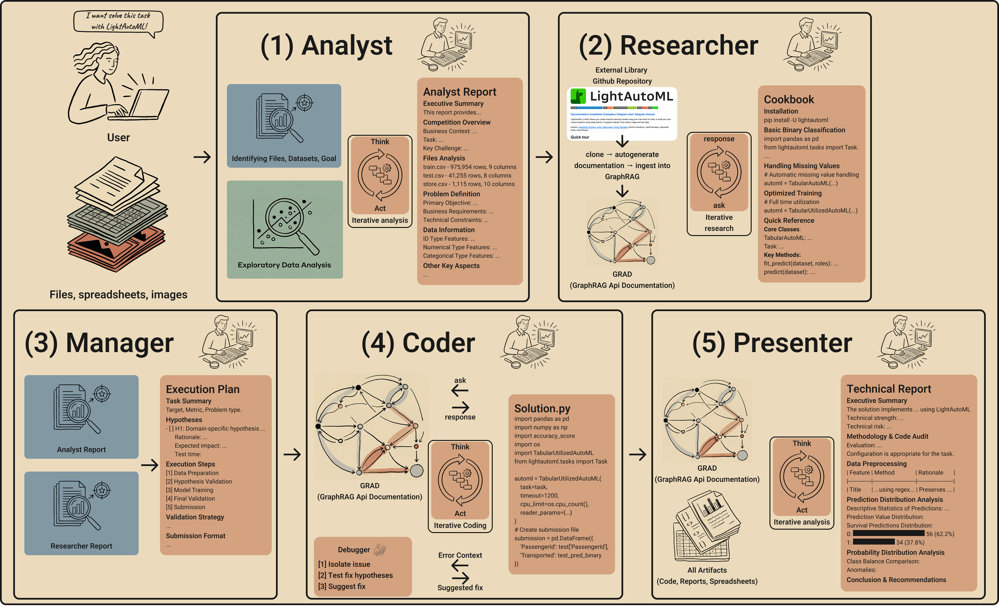

# AutoDS-Tools


**AutoDS-Tools** is a multi-agent framework designed for the automated integration of external data science tools into LLM-driven AutoML workflows. It enables understanding and utilization of specialized ML libraries through a graph-based documentation system, addressing the critical limitation of effectively integrating novel external tools that may not be well-represented in LLM training data.

## DEMO

[Watch the Video on YouTube](https://youtu.be/H_88VTaxsfs)

## Overview

Large language models (LLMs) have advanced automated machine learning (AutoML), enabling more exploratory and real-world-aligned workflows. However, existing LLM-based AutoML systems struggle with integrating specialized external tools, often relying solely on internal model knowledge that may be outdated or incomplete for domain-specific libraries.

**AutoDS-Tools** addresses this challenge through:

- **Multi-agent orchestration**: Six specialized agents working in a coordinated workflow
- **GRAD (Graph RAG API Documentation)**: On-demand indexing and querying of external library documentation
- **Iterative refinement**: ReAct-based reasoning loops for robust solution development

## Architecture



The system comprises five main specialized agents operating in a sequential workflow:

1. **Analyst**: Explores dataset structure, performs exploratory data analysis, and generates an Analyst Report with problem definition, data information, and key aspects.

2. **Researcher**: Selects suitable ML/DS libraries, conducts in-depth study through GRAD, and generates a Cookbook with installation instructions, usage examples, and quick reference guides.

3. **Manager**: Creates a detailed Execution Plan based on Analyst and Researcher reports, including hypotheses, validation strategy, and step-by-step implementation guide.

4. **Coder**: Implements the plan through iterative code generation and execution, with integrated Debugger sub-component for error isolation and resolution. Uses GRAD for library-specific queries.

5. **Presenter**: Generates a Technical Validation Report auditing the solution for production-readiness, including methodology review, prediction distribution analysis, and recommendations.

All agents operate within a LangGraph state machine, exchanging structured reports that form a cumulative knowledge chain while preventing context overflow.

## Installation

### Prerequisites

- Python 3.12 or higher
- Node.js 18+ and npm (for Web UI frontend)

### Install AutoDS-Tools

```bash
# Clone the repository
git clone https://github.com/AaLexUser/AutoDS-Tools.git
cd AutoDS-Tools

# Install the package
pip install -e .

# Or using uv
uv pip install -e .
```

### Configuration

Create configuration file at `~/.autods/autods_config.yaml`:

```yaml
model_providers:
  openai:
    provider: openai
    api_key: ${OPENAI_API_KEY}

models:
  gpt-5:
    model: gpt-5
    model_provider: openai
    max_retries: 3

agents:
  autods:
    model: gpt-5
    max_steps: 50
    analyst_steps: 5
    researcher_steps: 5
    planner_steps: 5
    debugger_steps: 5
    presenter_steps: 5
```

See [Backend Configuration](#backend-configuration) for detailed configuration options.

## Quick Start - Web UI

The Web UI is the recommended way to interact with AutoDS-Tools, providing a modern interface with real-time agent output, session management, and artifact exploration.

### Step 1: Start the FastAPI Backend

```bash
# Start API server on localhost:8000
uvicorn autods.web.api:create_app --factory --host localhost --port 8000
```

The backend will be available at `http://localhost:8000`.

### Step 2: Start the Next.js Frontend

In a separate terminal:

```bash
cd frontend
npm install
npm run dev
```

The frontend will start on `http://localhost:3000`.

### Access the Web UI

Open your browser and navigate to `http://localhost:3000`. You can now:

- Create or resume sessions
- Upload datasets (CSV, Parquet, JSON)
- Submit tasks and watch real-time agent execution
- Browse generated artifacts and preview files
- Install Python libraries in session environments
- Manage GRAD-indexed libraries

## CLI Commands (Alternative)

For headless/scripting use cases, AutoDS-Tools provides a command-line interface:

```bash
# Execute a single task
autods exec "Solve this classification task using LightAutoML"

# Start an interactive chat session
autods chat

# Resume an existing session
autods resume <session-id>

# View help
autods --help
```

## Environment Variables

The frontend uses `NEXT_PUBLIC_API_URL` (defaults to `http://localhost:8000`).

Optional: create `frontend/.env.local` to override:

```bash
NEXT_PUBLIC_API_URL=http://your-api-host:8000
```

## GRAD (Graph RAG API Documentation)

GRAD enables agents to understand and utilize external Python libraries by automatically extracting structured API documentation and ingesting it into a knowledge graph.

### How It Works

1. **Documentation Generation**: Clones a GitHub repository and performs static analysis to extract:
   - API entities (classes, methods, functions)
   - Docstrings, signatures, and type hints
   - Usage examples from tests, notebooks, and documentation

2. **GraphRAG Integration**: Ingests documentation into a knowledge graph using Cognee, establishing relationships between entities.

3. **Agent Integration**: Agents query GRAD via the `libq` tool with natural language questions about library usage.

### Using GRAD

Agents automatically use GRAD when they encounter a library. You can also manually add repositories:

```bash
# Add a repository to GRAD
uv run autods/grad/grad.py add https://github.com/owner/repo_name

# Query a repository
uv run autods/grad/grad.py ask https://github.com/owner/repo_name "How to use this library?"
```

For troubleshooting and advanced usage, see [`autods/grad/README.md`](autods/grad/README.md).

## Backend Configuration

Configuration is managed via YAML at `~/.autods/autods_config.yaml`. Key sections:

### Model Providers

```yaml
model_providers:
  openai:
    provider: openai
    api_key: ${OPENAI_API_KEY}
  anthropic:
    provider: anthropic
    api_key: ${ANTHROPIC_API_KEY}
  google:
    provider: google-genai
    api_key: ${GOOGLE_API_KEY}
```

### Models

```yaml
models:
  gpt-5:
    model: gpt-5
    model_provider: openai
    max_retries: 3
```

### Agent Configuration

```yaml
agents:
  autods:
    model: gpt-5
    max_steps: 50
    analyst_steps: 5      # Steps for Analyst agent (0 = skip)
    researcher_steps: 5   # Steps for Researcher agent (0 = skip)
    planner_steps: 5      # Steps for Manager/Planner agent (0 = skip)
    debugger_steps: 5     # Steps for Debugger agent (0 = skip)
    presenter_steps: 5    # Steps for Presenter agent
    validate_submission_imports: false
```

### Environment Variable Substitution

Use `${VAR_NAME}` syntax for environment variable substitution:

```yaml
model_providers:
  openai:
    api_key: ${OPENAI_API_KEY}  # Reads from environment
```

## License

See [LICENSE](LICENSE) file for details.
