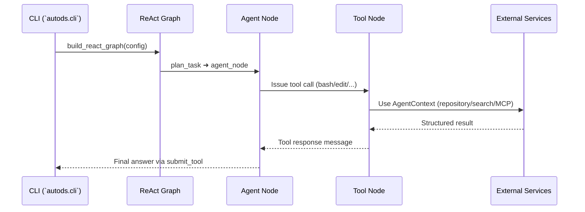

# `autods.tools` Developer Guide

This package hosts the first-party LangGraph tools that power the Autods ReAct agent, along with helper utilities (decorators, shared runners, MCP integration, and template bundles). Use this document as a map when you need to understand, extend, or debug agent actions.

## Package In Context

- `autods.cli` builds the ReAct graph defined in `autods/graph/` and injects an `AgentContext` with concrete services (LLM, repository, optional search).
- `autods.graph.nodes` seeds the tool node with the base tools from this package and optionally adds MCP-provided tools.
- Each tool here is a LangChain `@tool` callable. Tool functions read runtime services from `langgraph.runtime.get_runtime(AgentContext)` rather than importing heavy dependencies directly.
- Logging is standardized through `autods.tools.decorators.log_io`, so tool I/O automatically lands in the shared logger.

## Directory Map

| Path | Type | Description |
|------|------|-------------|
| `base.py` | helper | Shared `ToolError` base exception for consistent error messaging. |
| `decorators.py` | helper | `log_io` decorator that captures tool inputs/outputs for troubleshooting. |
| `run.py` | helper | Async shell runner with timeout + truncation helpers, reused by file tools. |
| `bash_tool.py` | tool | Long-lived bash session manager for shell execution inside the workspace. |
| `edit_tool.py` | tool | Structured editing helper (view/create/replace/insert) for repository files. |
| `jupyter.py` | tool | Notebook execution helper that maintains a persistent kernel and notebook file. |
| `plan.py` | tool | Maintains the agent-visible execution plan (`create`, `update`, `mark_step`, `get`). |
| `repository_tool.py` | tool | Wrapper around `repository_service` for browsing code, PRs, issues, commits. |
| `repository_analysis_tool.py` | tool | Produces a one-shot repository dossier (metadata, tree, sampled contents). |
| `submit_tool.py` | tool | Signals task completion back to the orchestrator with an optional summary. |
| `fetch_tool.py` | tool | Single-URL crawler that uses the configured `search_service` adapters. |
| `web_search_tool.py` | tool | Query -> retrieve -> compress -> synthesize pipeline for web search. |
| `mcp_connector.py` | infra | Loads Model Context Protocol (MCP) tools based on runtime config. |
| `templates/` | data | Project skeletons/templates surfaced by higher-level tools. |

## Execution Flow



## Core Tool Inventory

| Module | Tool name | Primary responsibility | Output format | Key dependencies |
|--------|-----------|------------------------|---------------|------------------|
| `bash_tool.py` | `bash_tool` | Persistent bash session with timeout and sentinel-based result parsing. | JSON-ish dict rendered as Markdown | `asyncio`, `_BashSession`, `ToolError` |
| `edit_tool.py` | `edit_tool` | Deterministic file mutations (`view`, `create`, `str_replace`, `insert`). | Markdown snippet with context | `pathlib`, `autods.tools.run.maybe_truncate` |
| `jupyter.py` | `jupyter` | Execute Python or markdown cells in a persistent notebook and surface text/images. | LangChain content list (text + image blocks) | `JupyterExecutor`, `nbclient`, `rich` |
| `plan.py` | `plan_tool` | Lightweight plan state machine stored in-process (no persistence). | Markdown plan summary | Global `_current_plan` |
| `repository_tool.py` | `repository_tool` | Proxy to `repository_service` for metadata, browse, PR/issue listings. | Markdown sections & tables | `AgentContext.repository_service` |
| `repository_analysis_tool.py` | `repository_analysis_tool` | Generates full repository dossier (stats, tree, sampled contents). | Rich Markdown with tables/code fences | `repository_service.browse/get_file_content` |
| `submit_tool.py` | `submit_tool` | Graceful terminal action for the agent run. | Single line confirmation | None beyond logging |
| `fetch_tool.py` | `fetch_tool` | Fetches/crawls a single URL and formats the document. | Markdown with warning footers | `search_service.crawl`, `MarkdownFormatter` |
| `web_search_tool.py` | `web_search_tool` | Multi-hit search + LLM summarization with deterministic fallback. | Markdown synthesis with citations | `search_service.search`, `build_messages`, `TokenBudget` |

## Tool Arguments & Commands

| Tool | Commands / Modes | Required args | Optional args | Notes |
|------|------------------|---------------|---------------|-------|
| `bash_tool` | N/A (single command) | `command` | `restart` (bool to reset session) | Runs inside a persistent `_BashSession`; returns stdout/stderr/error code. |
| `edit_tool` | `view`, `create`, `str_replace`, `insert` | `path`; command-specific (`file_text` for `create`, `old_str` for `str_replace`, `new_str`/`insert_line` for `insert`) | `view_range`, `new_str` (for `str_replace`) | Absolute paths only; rejects destructive `create` on existing files. |
| `jupyter` | N/A (single command) | `code` | `language` (`python` or `markdown`) | Maintains a persistent kernel, saves updates to `code.ipynb`, returns text + inline base64 images. |
| `plan_tool` | `create`, `update`, `mark_step`, `get` | `title`, `steps` for `create`; `step_index` for `mark_step` | `title`, `steps` on update; `step_status`, `step_notes` on mark | Persists plan state in-process via `_current_plan`. |
| `repository_tool` | `get_repo`, `get_code`, `get_file`, `get_prs`, `get_issues`, `get_discussions`, `get_commits`, `search_code` | `command`, `repo_url` | `path`, `ref`, `state`, `number`, `limit`, `query` | Uses `AgentContext.repository_service`; GitHub and local repos supported. |
| `repository_analysis_tool` | N/A (single command) | `repo_url` | `ref`, `max_file_size`, `max_files` | Generates combined metadata/tree/content report; honours size limits. |
| `submit_tool` | N/A (single command) | None | `summary` | Sends completion signal with optional summary text. |
| `fetch_tool` | N/A (single command) | `url` | None | Crawler output formatted as Markdown; raises runtime error when search service missing. |
| `web_search_tool` | N/A (single command) | `query` | `max_results`, `answer_style` | Retrieves hits via `search_service`, then synthesizes answer while enforcing token budget. |

## Search Tooling Activation

- Search tools (`web_search_tool`, `fetch_tool`) ship disabled by default to avoid dependency churn. Call `autods.graph.nodes.enable_search_tools()` during context setup if `search_service` is configured.
- Both tools expect `AgentContext.search_service` to expose `search()`/`crawl()` and `last_*_warnings` attributes. The Streamlit playground in `autods/search/` is a good reference implementation.
- Token budgeting relies on `autods.search.pipeline.TokenBudget`. Provide a model name on `AgentContext.llm_client` to get accurate estimates.

## Repository Integrations

- `repository_tool` and `repository_analysis_tool` rely on `AgentContext.repository_service`, which is composed in `autods.repository`. The service abstracts GitHub REST + local git support, so tools stay provider-agnostic.
- When adding new repository commands, extend the service first, then update the tool's `Literal[...]` command list and formatter helpers.
- Large directory listings are flattened before formatting. Mind the `max_file_size`/`max_files` defaults to avoid multi-megabyte responses.

## MCP Connector Lifecycle

1. Load config via `autods.utils.config.Config` (populated from CLI flags or `autods_config.yaml`).
2. `create_mcp_connector(config)` instantiates `MCPConnector`, filters allowed servers, and initializes `langchain_mcp_adapters.MultiServerMCPClient`.
3. Tools surfaced by MCP servers are merged with `_base_tools` by `autods.graph.nodes._rebuild_tool_node()`.
4. If initialization fails, the agent continues with core tools only; errors are logged but not fatal.

When debugging MCP issues, check the logger for per-tool load messages and verify the `allow_mcp_servers` filter in your config.

## Templates Overview

The `templates/` directory provides starter assets for domain-specific scenarios (e.g., LightAutoML, Replay, Tsuru). Tools outside this package can surface them by reading from the filesystem; this README treats them as opaque data but remember to update any template manifest if you add new folders.

```plaintext
templates/
├── lightautoml_template
├── ptls_template
├── pyboost_template
├── replay_template
└── tsuru_template
```

## Adding Or Modifying A Tool

1. **Author the tool**: Create a new module or extend an existing one, define a Pydantic input schema, and decorate the callable with `@tool(..., args_schema=...)` plus `@log_io`.
2. **Wire it in**: Import the tool in `autods/graph/nodes.py`, append it to `_base_tools`, and rebuild the tool node if necessary.
3. **Expose runtime services**: If the tool needs new infrastructure, extend `AgentContext` and initialize the service within `autods.cli`.
4. **Test**: Write unit specs under `tests/unit/tools/` or scenario tests in `tests/integration/`. Use `uv run pytest tests/unit/tools/test_<tool>.py`.
5. **Document**: Update this README table and, if applicable, add config keys to `autods_config.yaml.example`.

## Debugging & Validation Tips

- Use `log_io` output (e.g., `logger.info`) to trace tool arguments and responses when runs misbehave.
- Invoke individual tools with `uv run python -m autods.cli tool --name <tool_name> --json '<args>'` (see CLI help) for manual testing.
- Run targeted checks:
  - `uv run pytest tests/unit/tools/` for fast feedback
  - `make test-integration` before shipping changes that touch repository/search side effects
  - `make lint` to ensure new modules pass Ruff and import order rules
- For shell-related issues, the `_BashSession` in `bash_tool.py` supports restarting by sending `restart=true` in `BashInput`.

## Further Reading

- `autods/graph/builder.py` for how the tool node plugs into the ReAct graph.
- `autods/prompt/` for the prompts that instruct the agent on when to call which tools.
- `autods/search/README.md` (if present) for end-to-end search service contracts.
